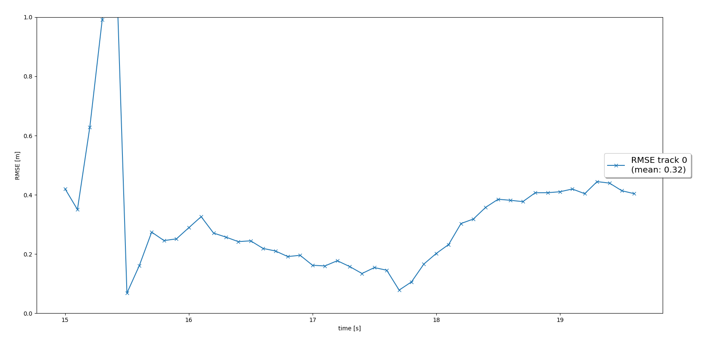
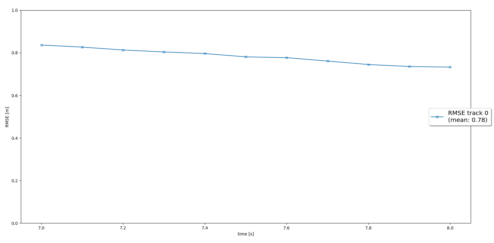
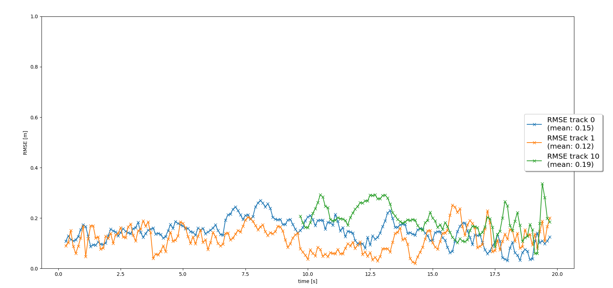
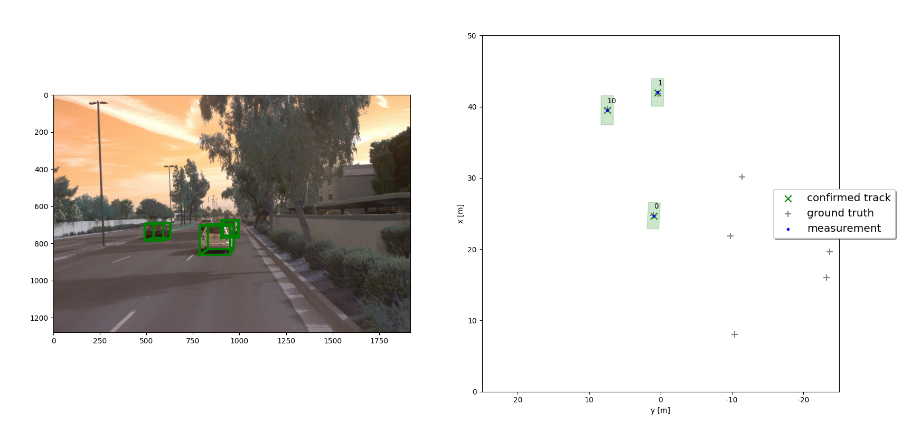
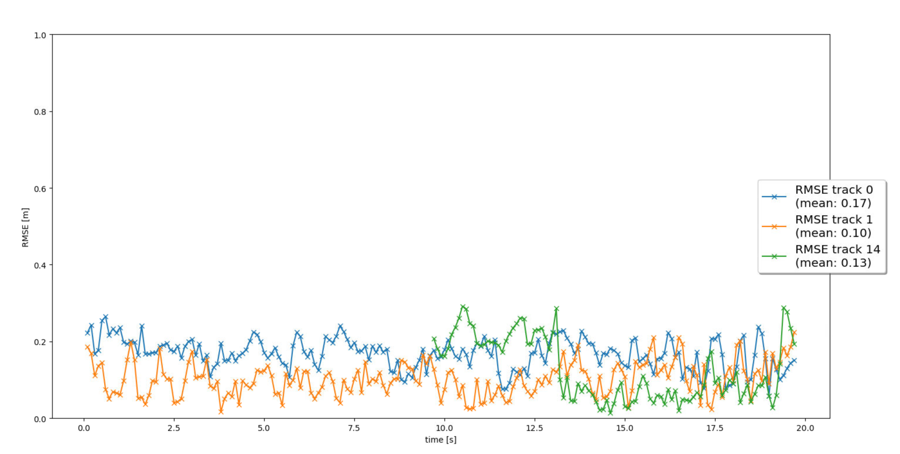

# Writeup: Track 3D-Objects Over Time

## Step 1 - Single Tracking RMSE

## Step 2 - Track Management RMSE

## Step 3 - Data Association

## Step 4 - Sensor Fusion

#### 1. Write a short recap of the four tracking steps and what you implemented there (filter, track management, association, camera fusion). Which results did you achieve? Which part of the project was most difficult for you to complete, and why?

1. EKF
- Here, we implemented a Kalman Filter to track a single car with just Lidar measurement data. 
2. Track management
- Here, we implemented logic to initialize a track and change its state based on the track scores (i.e. how often each track has been detected). This way, we only focus on tracks that are likely real obstacles like cars and pedestrians. 
3. Data Association
- We implemented an algorithm to associate tracks to measurements. This part took advantage of nearest neighbor search using the Mahalanobis distance
4. Sensor Fusion
- We add camera data to our tracking implementation so that we can get better estimations of each track's position. We implemented the nonlinear relation between the camera coordinate frame and the vehicle coord system. 

The most difficult part was the sensor fusion, because we had to account for the non-linear state <-> measurement model. 

#### 2. Do you see any benefits in camera-lidar fusion compared to lidar-only tracking (in theory and in your concrete results)? 

In theory, we should get some benefits for camera-lidar fusion because it is another real-world measurement of obstacle locations. In the results, we can definitely see some improvement. Except for the first track, the average RMSE decreased when we included camera sensor data. 

#### 3. Which challenges will a sensor fusion system face in real-life scenarios? Did you see any of these challenges in the project?

Some challenges include
- Occlusions like from low-hanging trees
- Weather-related issues like cloudy or rainy scenarios

These challenges would prevent some sensors from properly detecting objects, and thus our measurements may be off. Fortunately, we did not encounter these issues in the project. 

#### 4. Can you think of ways to improve your tracking results in the future?

We can use uncsented Kalman Filters for non-linear motion. We could also improve our data association algorithm to something far more advanced. 