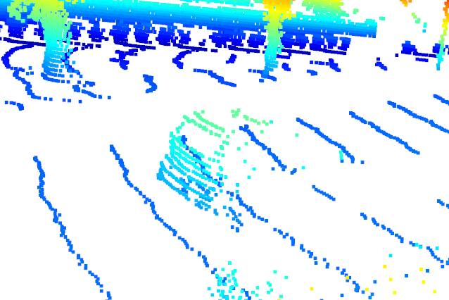
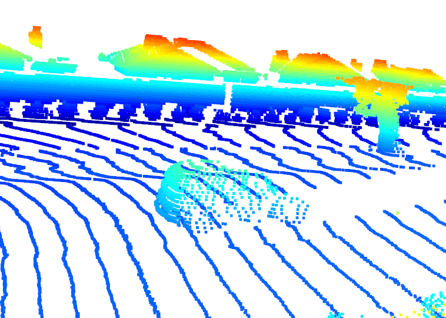
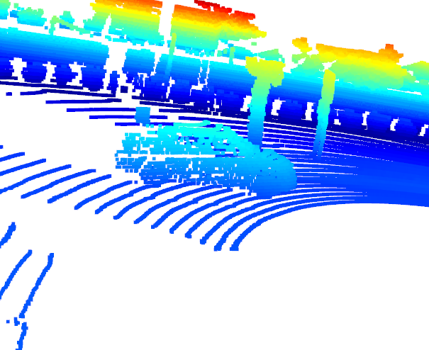
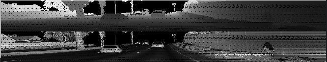
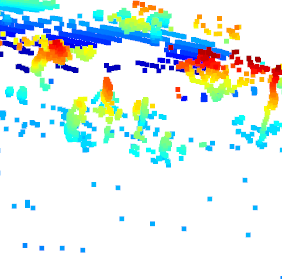
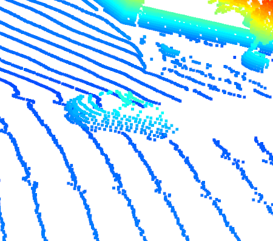
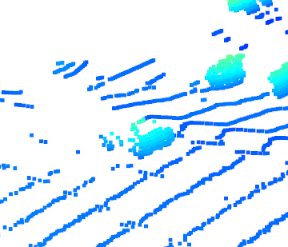
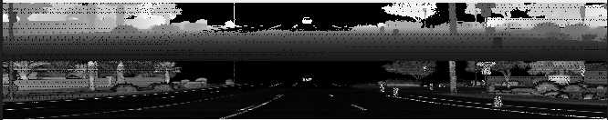
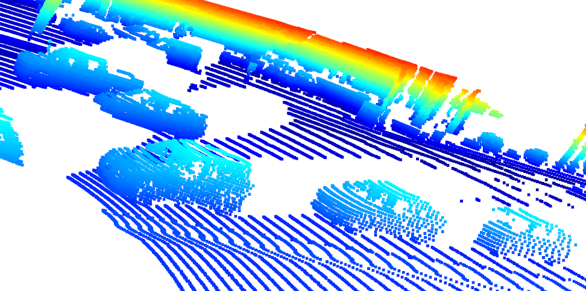
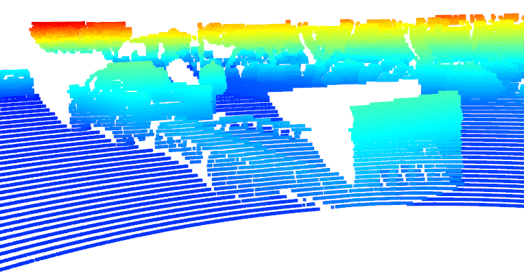

# Midterm Writeup
The midterm requirements are embedded within the visualizations for each training video. 

## Video 1

In just one scene of the video, we can see varying visibilities for 3 different cars:

We can see the first two cars in the range image:

One thing to note is the vehicle features that the lidar captured consistently well are the front and rear bumpers. 

## Video 2
This video has the most variance in point clouds for vehicles in the scene. For example, we have a very sparse representation of a vehicle

Then, we can clearly spot a vehicle entering the lidar's range and the point cloud is quite dense:

There is a vehicle who's doors, hood, and roof are captured by the lidar:

Then, we have a vehicle who's rear bumper is modeled well by the point cloud:

We can see this car in the range image:

Like the first video, the most stable features of all vehicles in this scene are the rear & front bumpers. 

## Video 3
In this video, the lidar point cloud captures all the nearby cars almost perfectly. For the parked cars on the right, we can see that the visible surface of the car is mapped out perfectly. We can also see that the truck and its trailer are also mapped out very well, most specifically the rear of the vehicle. This must help prevent the self-driving vehicle from hitting the car. 

