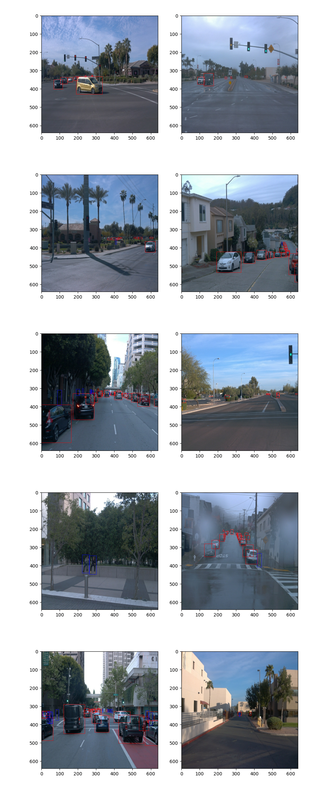
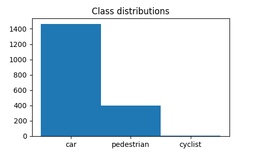
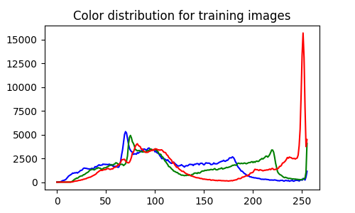
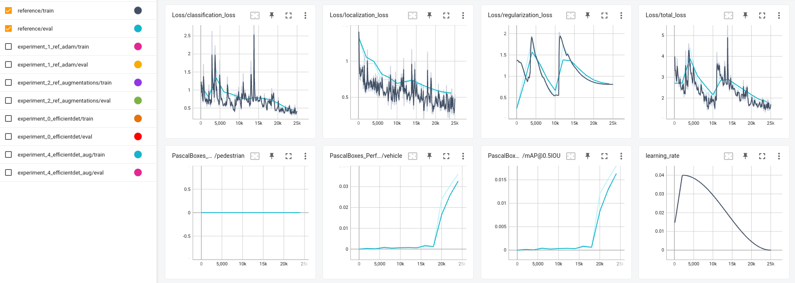
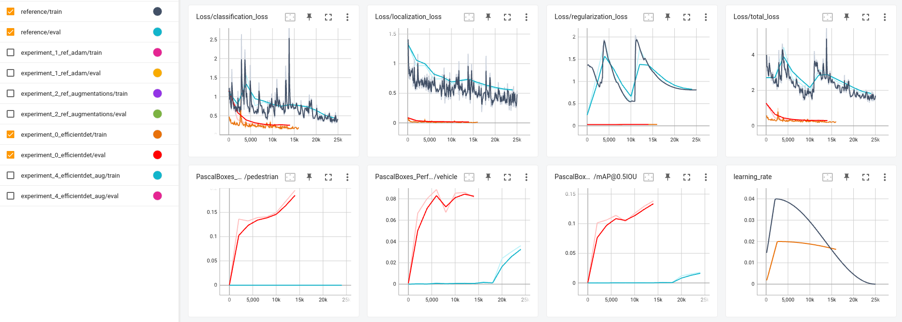
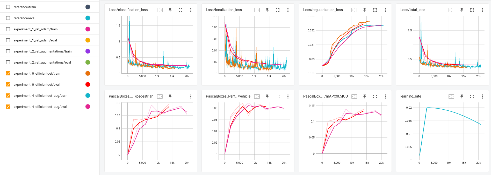

# Object Detection on a Sample of Waymo's Dataset

### Overview
Object detection is a crucial part of self driving car systems because it enables the car to find and obey traffic lights/signs and avoid other cars, any pedestrians, and obstacles. This project involves applying pre-trained object detection models to detect vehicles, pedestrians, and cyclists on a light dataset of front-view camera images provided by Waymo. Our goal is to train a performant and accurate object detection network that can reliably detect surrounding objects in sundry environments and scenarios. 

### Setup
1. Download Data
```bash
python download_process.py --data_dir {processed_file_location} --size {number of files you want to download}
python create_splits.py --source {processed_file_location} --destination {new_location}
```

2. Execute training
```bash
python experiments/model_main_tf2.py --model_dir=experiments/{experiment}/ --pipeline_config_path=experiments/{experiment}/{.config file}
# in a separate shell
python -m tensorboard.main --logdir experiments/reference/
```

3. Evaluate
```bash
python experiments/model_main_tf2.py --model_dir=experiments/{experiment}/ --pipeline_config_path=experiments/{experiment}/{.config file} --checkpoint_dir=experiments/{experiment}/
```

## Dataset Analysis



In a sample of 10 images of the training dataset, the first thing to note is that most of the images are taken in a sunny environment - there are only a few images in darker environments, whether that be cloudy, nighttime, etc. Second, there are barely any cyclists in this dataset sample. See below for the class distribution:

<center>

</center>

Most of the objects are cars, only some are pedestrians, and almost no cyclists. Without any modification, this class imbalance is bound to cause the model to not even detect cyclists at all. 

<center>

</center>


## Experiments

### Reference Model (SSD)
<center>

</center>

### Reference Model With Augmentations
<center>

</center>

### EfficientDet
<center>

</center>

### EfficientDet with Augmentations
<center>

</center>