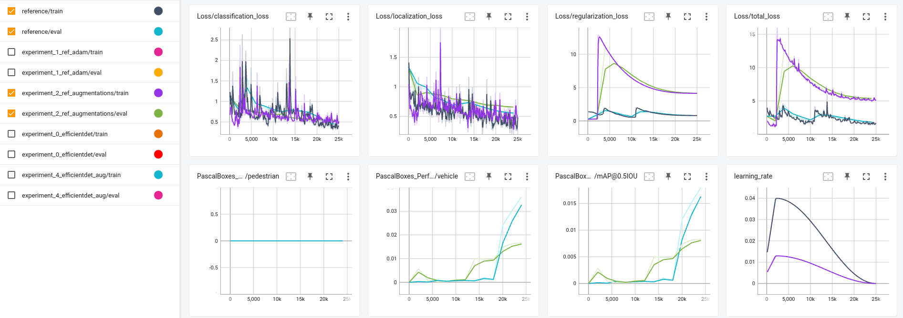

# Object Detection on a Sample of Waymo's Dataset

### Overview
Object detection is a crucial part of self driving car systems because it enables the car to find and obey traffic lights/signs and avoid other cars, any pedestrians, and obstacles. This project involves applying pre-trained object detection models to detect vehicles, pedestrians, and cyclists on a light dataset of front-view camera images provided by Waymo. Our goal is to train a performant and accurate object detection network that can reliably detect surrounding objects in sundry environments and scenarios. 

### Setup
1. Download Data
```bash
python download_process.py --data_dir {processed_file_location} --size {number of files you want to download}
python create_splits.py --source {processed_file_location} --destination {new_location}
```

2. Execute training
```bash
python experiments/model_main_tf2.py --model_dir=experiments/{experiment}/ --pipeline_config_path=experiments/{experiment}/{.config file}
# in a separate shell
python -m tensorboard.main --logdir experiments/reference/
```

3. Evaluate
```bash
python experiments/model_main_tf2.py --model_dir=experiments/{experiment}/ --pipeline_config_path=experiments/{experiment}/{.config file} --checkpoint_dir=experiments/{experiment}/
```

## Dataset Analysis


In a sample of 10 images of the training dataset, the first thing to note is that most of the images are taken in a sunny environment - there are only a few images in darker environments, whether that be cloudy, nighttime, etc. Second, there are barely any cyclists in this dataset sample. See below for the class distribution:

<center>

</center>

Most of the objects are cars, only some are pedestrians, and almost no cyclists. Without any modification, this class imbalance is bound to cause the model to not even detect cyclists at all. 

<center>

</center>

Another point to note about the data is the class distribution. The most obvious information is that the distribution of saturated red colors is extremely high as compared to blue and green. This must be due to the significant amount of brake and traffic lights in the scenes. 

## Experiments

### Reference Model (SSD)
<center>

</center>

The reference model is a SSD with a ResNet50 backbone. The reference model performed quite poorly, likely due to a very high learning rate. The loss increases to some local maxima twice during training, and up until the last maxima, the metric performance was near zero. Even when the loss slightly converged at the end, the metrics were still two or three orders of magnitude below zero. The next experiment applies augmentations and a lower learning rate. 

### Reference Model With Augmentations
<center>

</center>
This experiment applied the following augmentations:

- Random Distort Color
- Random AdjustBrightness
- Random Adjust Contrast
- Random Adjust Saturation

I chose these augmentations with the attempt to randomly make some images darker so that the model is trained on a balance of environments. However, even with a lower learning rate, the regularization loss seems to always spike at around 5k steps. Up until 5k, we are able to see that the loss and metrics are better than that of the reference, so the data augmentations must be useful. Further experiments with a lower learning rate could prove beneficial here - for now, I decided to change the model architecture to an EfficientDet because I felt that the base SSD was generally not robust enough on this dataset.  

### EfficientDet
<center>

</center>

With no augmentations, the EfficientDet significantly outperforms the reference network. While EfficientDet is likely a _smaller_ network than the reference due to the backbone, it is very interesting to see that the metrics are well above zero and the total loss is sub-one right off the bat. The EfficientDet paper shows that it reaches better performance than the ResNet50-based networks by introducing a Bi-directional feature pyramid network and unique feature fusion. 


### EfficientDet with Augmentations
<center>

</center>

I applied the same augmentations here as we did with the reference model. One benefit relates to the regularization loss - it's a bit lower than the previous experiment which means the data augmentations are helping the model become less prone to overfitting. However, the metric performance is nearly the same. 